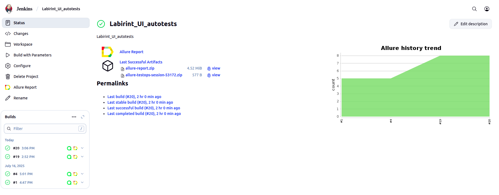
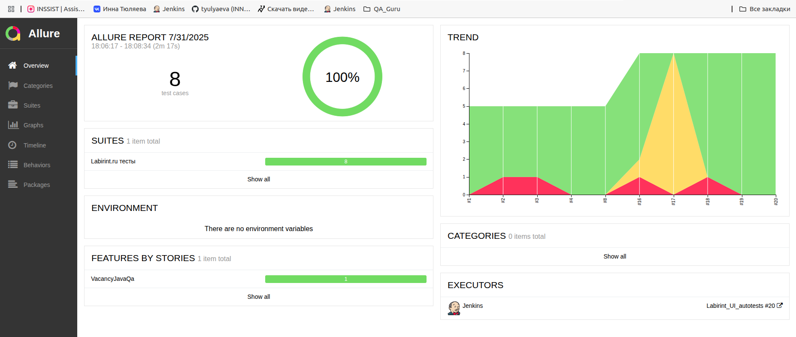
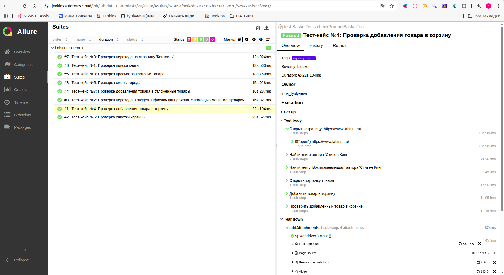
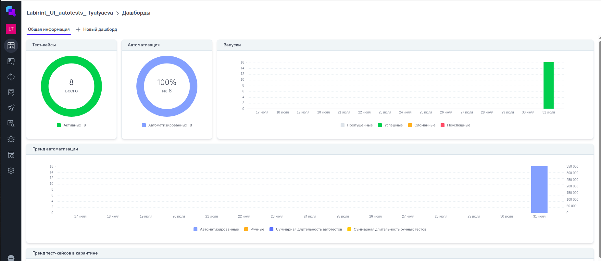
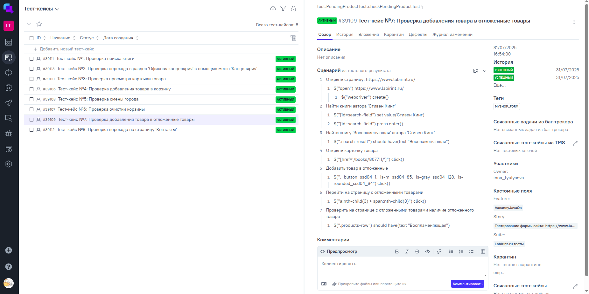
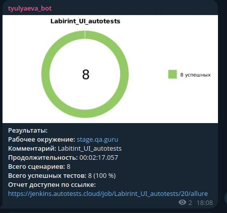
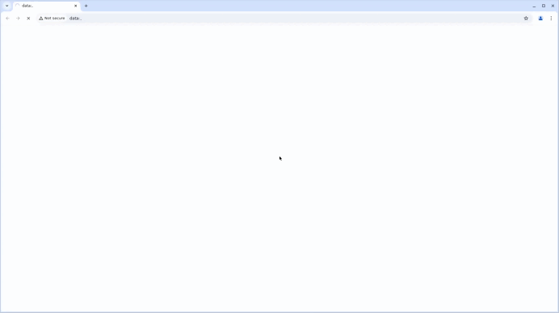

<p align="center">
  <a href="https://www.labirint.ru/">
    
  </a>
</p>

<h1 align="center">Проект по автоматизации тестирования для компании <a href="https://www.labirint.ru/">Лабиринт</a></h1>

---

## ☑️ Содержание
- <a href="#tools"> Технологии и инструменты</a>
- <a href="#checking"> Реализованные проверки</a>
- <a href="#jenkins"> Сборка в Jenkins</a>
- <a href="#console"> Запуск тестов </a>
- <a href="#allureReport"> Allure отчет</a>
- <a href="#allure"> Интеграция с Allure TestOps</a>
- <a href="#jira"> Интеграция с Jira</a>  
- <a href="#tg"> Уведомления в Telegram с использованием бота</a>
- <a href="#video"> Примеры видео выполнения тестов</a>
---

<a id="tools"></a>
<h2>🛠️ Технологии и инструменты</h2>

<table>
  <tr>
    <th><a href="https://www.oracle.com/java/" target="_blank">Java</a></th>
    <th><a href="https://www.jetbrains.com/idea/" target="_blank">IntelliJ IDEA</a></th>
    <th><a href="https://github.com/" target="_blank">GitHub</a></th>
    <th><a href="https://junit.org/junit5/" target="_blank">JUnit 5</a></th>
    <th><a href="https://gradle.org/" target="_blank">Gradle</a></th>
    <th><a href="https://selenide.org/" target="_blank">Selenide</a></th>
    <th><a href="https://aerokube.com/selenoid/" target="_blank">Selenoid</a></th>
    <th><a href="https://docs.qameta.io/allure/" target="_blank">Allure Report</a></th>
    <th><a href="https://www.jenkins.io/" target="_blank">Jenkins</a></th>
    <th><a href="https://telegram.org/" target="_blank">Telegram</a></th>
  </tr>
  <tr>
    <td align="center">
      <a href="https://www.oracle.com/java/" target="_blank">
        
      </a>
    </td>
    <td align="center">
      <a href="https://www.jetbrains.com/idea/" target="_blank">
        
      </a>
    </td>
    <td align="center">
      <a href="https://github.com/" target="_blank">
        
      </a>
    </td>
    <td align="center">
      <a href="https://junit.org/junit5/" target="_blank">
        
      </a>
    </td>
    <td align="center">
      <a href="https://gradle.org/" target="_blank">
        
      </a>
    </td>
    <td align="center">
      <a href="https://selenide.org/" target="_blank">
        
      </a>
    </td>
    <td align="center">
      <a href="https://aerokube.com/selenoid/" target="_blank">
        
      </a>
    </td>
    <td align="center">
      <a href="https://docs.qameta.io/allure/" target="_blank">
        
      </a>
    </td>
    <td align="center">
      <a href="https://www.jenkins.io/" target="_blank">
        
      </a>
    </td>
    <td align="center">
      <a href="https://telegram.org/" target="_blank">
        
      </a>
    </td>
  </tr>
</table>


<a id="checking"></a>
## ✅ Реализованные проверки

- Тест-кейс №1: Проверка поиска книги
- Тест-кейс №2: Проверка перехода в раздел 'Офисная канцелярия' с помощью меню 'Канцелярия'
- Тест-кейс №3: Проверка просмотра карточки товара
- Тест-кейс №4: Проверка добавления товара в корзину
- Тест-кейс №5: Проверка смены города
- Тест-кейс №6: Проверка очистки корзины
- Тест-кейс №7: Проверка добавления товара в отложенные товары
- Тест-кейс №8: Проверка перехода на страницу 'Контакты'

---
<a id="jenkins"></a>
## </a> Сборка в <a target="_blank" href="https://jenkins.autotests.cloud/job/Labirint_UI_autotests/"> Jenkins </a>
Для запуска сборки необходимо перейти в раздел <code>Собрать с параметрами</code>, выбрать необходимые параметры и нажать кнопку <code>Собрать</code>.
<p align="center">
<a href="https://jenkins.autotests.cloud/job/Labirint_UI_autotests/"></a>
</p>
После выполнения сборки, в блоке История сборок напротив номера сборки появятся значки Allure Report и Allure TestOps, при клике на которые откроется страница с сформированным html-отчетом и тестовой документацией соответственно.

<a id="console"></a>
<p align="center">
</p>

### ⚙️ Параметры сборки
- `task` (выборка набора тестов для запуска)
- `browser` (доступные браузеры: Chrome и Firefox)
- `browserVersion` (доступные версии Chrome: 127.0, 128.0; 
доступные версии Firefox: 124.0, 125.0)
- `browserSize` (доступные размеры окна браузера: 1920x1080, 1280x720,800x600)
- `environment` (доступное окружение: stage.usetech.ru, test.usetech.ru)
- `comment` (комментарий)
- `selenoid_remote_server` (логин, пароль и адрес удаленного сервера Selenoid)

### 🔧 Команды для запуска из терминала

**Локальный запуск**
```bash
gradle clean myshop_form
```

**Запуск с параметрами**
```bash
-Dbrowser=chrome -DbrowserSize=1920x1080 -DbrowserVersion=128.0
```

**Удалённый запуск через Jenkins**
```bash
clean
${TASK}
--info
-Dbrowser=${BROWSER}
-DbrowserVersion=${BROWSER_VERSION}
-DbrowserSize=${BROWSER_SIZE}
-DselenoidUrl=${SELENOID_URL}
-DselenoidUserLogin=${SELENOID_LOGIN}
-DselenoidUserPassword=${SELENOID_PASSWORD}
```
---

<a id="allureReport"></a>
##  [Allure](https://jenkins.autotests.cloud/job/Labirint_UI_autotests/20/allure/) отчет

### Главная страница отчета

<p align="center">

</p>

### Тест-кейсы

<p align="center">

</p>

---
<a id="allure"></a>
##  </a>Интеграция с <a target="_blank" href="https://allure.autotests.cloud/project/4843/dashboards">Allure TestOps</a>
На *Dashboard* в <code>Allure TestOps</code> видна статистика количества тестов. Новые тесты, а так же результаты прогона приходят по интеграции при каждом запуске сборки.
## Основная страница отчёта

<p align="center">  
  
</p>  

## Пример тест-кейса
<p align="center">

</p>

---

<a id="jira"></a>
##  Интеграция с [Jira](https://jira.autotests.cloud/browse/HOMEWORK-1462)

Реализована интеграция <code>Allure TestOps</code> с <code>Jira</code>, в тикете отображается, какие тест-кейсы были написаны в рамках задачи и результат их прогона.
### Задача в Jira

<p align="center">

</p>

#### Содержание задачи

- Цель
- Задачи для выполнения
- Тест-кейсы из Allure TestOps
- Результат прогона тестов в Allure TestOps

---

<a id="tg"></a>
##  Уведомления в Telegram чат с ботом

После завершения сборки специальный бот, созданный в <code>Telegram</code>, автоматически обрабатывает и отправляет сообщение с отчетом о прогоне тестов.

<p align="center">
  
</p>

---
## Содержание уведомления в Telegram

- Окружение
- Комментарий
- Длительность прохождения тестов
- Общее количество сценариев
- Процент прохождения тестов
- Ссылка на Allure отчет

---

<a id="video"></a>
## 🎥 Пример видео выполнения тестов (Selenoid)

<p align="center">
  
</p>
